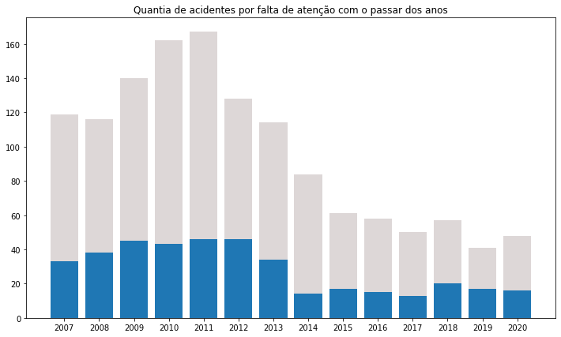

__Dataframe Utilizado__

Foi montando um dataframe próprio com apenas as colunas de ano e causas de acidentes. Ademais as causas foram filtradas e tratadas para evitar redundancias.

__Porcentagem de acidentes por ano__

Utilizando um gráfico de pizza foi amostrada a porcentagem por ano do total de acidentes presentes no dataframe.

Por conta desse gráfico foi perceptível que o ano com mais acidentes foi 2011.

__Qual a maior razão de acidentes no maior ano?__

Através de um gráfico de pizza, foi possível ver que com 27.5% a maior causa foi "falta de atenção".

Isso se torna mais visível num gráfico de linhas, pois a diferença quanto aos demais se torna mais vísivel devido a quantia de causas presentes no ano destacado.

__Como se comportar a razão de maior acidentes no ano com mais acidentes no passar dos anos?__

Quanto a porcentagem.

